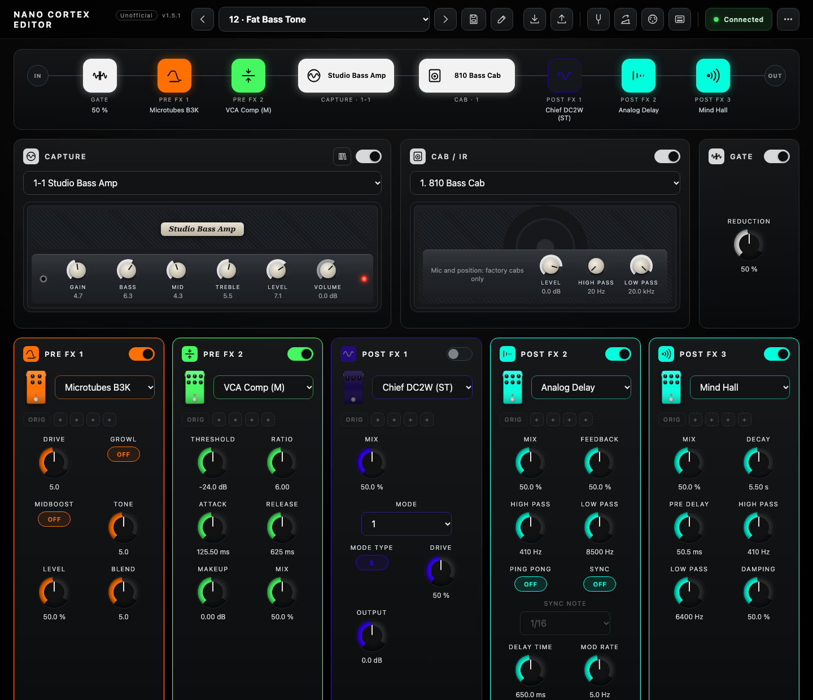

# Nano Cortex Editor (unofficial)

A desktop editor for the **Neural DSP Nano Cortex** that talks to the pedal over Bluetooth.
It runs in Chrome/Edge (Web Bluetooth) or as a Mac app. Make sure the Nano Cortex has Nano Cortex in its name to avoid connection issues!

> **Unofficial community project.** Not affiliated with, endorsed by or supported by Neural DSP.
> "Nano Cortex", "Quad Cortex" and "Neural DSP" are trademarks of Neural DSP Technologies.
> The editor writes to your device. Use it at your own risk and keep backups of your presets
> (for example with the official Cortex Cloud app).



## Features

- **Presets**: switch presets over Bluetooth (no USB cable needed), rename, save (the Save button only shows "Saved" after reading the preset back); follows preset changes made on the pedal
- **Amp, gate and FX blocks**: all knobs with live, lag-free updates, model selection for Pre FX 1–2 and Post FX 1–3, block colours per effect category (Quad Cortex style)
- **FX presets** (as on the Nano Cortex Controller): four named settings per effect model above its knobs – click to
  load, right-click or hold to save, rename or delete; **ORIGINAL** returns to the settings read from the Nano
- **Preset files**: **Export** saves the current preset as a file (to keep or to share), **Import** – or dropping the
  file on the window – loads one into the current preset; **Save** keeps it. Captures and IRs travel by name: the
  import finds them in your slots or loads them from the Nano's library (factory and Cortex Cloud ones). The captures
  themselves cannot be transferred over Bluetooth.
- **Captures**: 25 capture slots plus the capture library on the device, with a browser for categories, instruments, tags and search; load library captures into a slot of your choice – the editor can show which presets use each slot and suggest a free one
- **Cab/IR**: slots, level, high/low pass, mic and position; load factory or user IRs from the device library into a slot
- **Tuner**: note and cents display, reference pitch (400–480 Hz), mute
- **Expression pedal**: per-preset assignments for Gain, Bass, Mid, Treble, Level, Gate and FX amounts (min/max, invert) and bypass switching (Heel-Toe, Switch, Stop)
- **MIDI controller with MIDI Learn**: map knobs and buttons of any USB/Bluetooth MIDI controller to amp, FX, gate, capture and cab controls, block on/off, tuner and preset up/down; optional pickup mode (no value jumps) and Program Change → preset
- **Morningstar MC6 Pro export**: pick up to five presets and create a bank file: page 1 A–E recall the presets, F opens an FX page where A–E switch the five FX slots on/off. The switches are named after the effect type, use the category colours and MC6 Pro icons, and show which effects each preset uses
- Drawn, brand-free pedal pictures for every effect model (your own pictures in `img/` are used when present)
- Log export for troubleshooting

## Use it

### In the browser

Open `index.html` in **Chrome** or **Edge** on macOS or Windows, click **Connect** and choose your Nano Cortex.
Safari and Firefox do not support Web Bluetooth.

Or open it directly, without downloading anything: **https://drd85.github.io/nano-cortex-editor/**

### Mac app

Download the zip from [Releases](../../releases), unzip it and move **Nano Cortex Editor.app** to *Applications*.
The app is not signed with an Apple Developer ID. On the first start, right-click it and choose **Open**.
If macOS says the app is damaged, run `xattr -cr "/Applications/Nano Cortex Editor.app"` once in Terminal.
macOS asks for Bluetooth access when you connect for the first time.

### With the Nano Cortex Controller

The [Nano Cortex Controller](https://github.com/DrD85/nano-cortex-controller) (an ESP32 touch screen with
footswitches, firmware 1.2.0 or newer) can pass the editor through to the Nano: switch the controller on, wait until
it has loaded the presets, then click **Connect** and choose **Nano Cortex Controller** (the Mac app picks it by
itself). The status shows *Connected via controller*, and editor and controller work at the same time. Without the
controller, connect to the Nano directly as before.

No board? The controller also runs in the browser:
[Nano Cortex Controller Web](https://github.com/DrD85/nano-cortex-controller-web).

## Build the Mac app

Requires [Node.js](https://nodejs.org) on an Apple Silicon Mac.

```bash
cd mac-app
./build.sh            # app for yourself, includes pedal pictures from ../img if present
./build.sh --public   # release build without pedal pictures, plus a zip in ../release
```

The app is a small [Electron](https://www.electronjs.org) shell around `index.html`
(Safari/WKWebView has no Web Bluetooth). It connects to the first Bluetooth device whose name contains
"Nano" or "Cortex" – the Nano itself or the Nano Cortex Controller. The version in `mac-app/package.json` must match
`EDITOR_VERSION` in `index.html` (shown next to the title); `build.sh` checks it.

## MIDI controller

Click **MIDI** → **Start MIDI Learn**, click a knob, slider or switch in the editor and move a control on your
MIDI controller. Assigned controls show their CC number; right-click a control to remove its assignment.
Assignments are stored in the browser/app. MIDI needs Chrome, Edge or the Mac app.

## Morningstar MC6 Pro

Click **MC6 Pro**, tick up to five presets, check the Nano's MIDI channel (read from the Nano automatically)
and press **Create bank file**. To read which FX are on in each preset, the editor loads each selected preset on the
Nano for a moment and then returns to the current one (save unsaved changes first). Load the file in the Morningstar editor (open a bank → *Load from File*) and save it
to the controller. Connect the MC6 Pro's USB Host port to the Nano's USB port: the Nano only accepts MIDI via USB.

**Expression switch (optional):** choose one FX switch (for example E for a reverb in Post FX 3) under *Expression switch*.
Instead of on/off it sends the expression pedal position (CC#1): dim = heel = *Min*, lit = toe = *Max* of that slot's
Amount under **Expression** in each preset. Every preset switch starts at heel. Once an expression switch is chosen, its
FX block in the editor shows two sliders, **Pos 1** and **Pos 2**: they set this range for the loaded preset, and dragging
one also sets the effect's Mix so you hear the result. The export preview warns about presets without that assignment
and lists other parameters that the expression pedal moves too.

The long name of each preset switch lists the effect types in Pre FX 1, Pre FX 2 and Post FX 1, for example
`Pit-Com-Cho` for pitch, compressor and chorus.

## Pedal pictures

Every effect model is shown as a simple drawn pedal in its category colour. If you prefer pictures, put your own PNG
files into an `img/` folder next to `index.html`, using the file names listed in `MODEL_IMAGES` inside
`index.html`. The `img/` folder is not part of this repository.

## How it works

The Nano Cortex exposes a Bluetooth LE service with a write characteristic (`c304`) and a notify
characteristic (`c305`). Messages are protobuf payloads framed as
`[length] C0 [payload] [32-bit little-endian message type]`; larger replies are split into several packets.
The message layouts used here are documented in comments in `index.html`.

## Credits

- [rixrix/deskop-nano-cortex](https://github.com/rixrix/deskop-nano-cortex) (Apache-2.0): its protocol
  notes helped with the state dump layout and the preset-change acknowledgement.

## License

[MIT](LICENSE)

---

## Deutsch (Kurzfassung)

Inoffizieller Editor für den Neural DSP Nano Cortex per Bluetooth. Er läuft in Chrome/Edge oder als Mac-App.
Du kannst Presets wechseln, umbenennen und speichern und Amp, Gate und Effekte live bearbeiten.
Captures und Cabs lädst du aus der Library des Geräts. Dazu gibt es einen Tuner, die Zuweisungen
für das Expression-Pedal und die Steuerung per MIDI-Controller mit MIDI Learn.
Die Mac-App gibt es unter *Releases*. Sie ist nicht signiert: Starte sie beim ersten Mal per Rechtsklick → **Öffnen**.
Der Editor schreibt auf dein Gerät, die Nutzung erfolgt auf eigene Gefahr.
